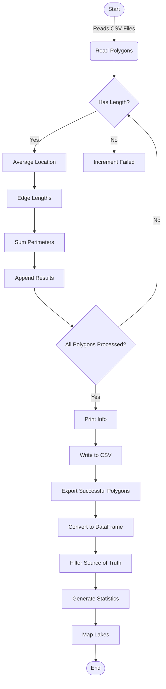

```mermaid
graph TD
    A([Start]) -->|Reads CSV Files| B(Read Polygons)
    B --> C{Has Length?}
    C -->|Yes| D[Average Location]
    C -->|No| E[Increment Failed]
    D --> F[Edge Lengths]
    F --> G[Sum Perimeters]
    G --> H[Append Results]
    H --> I{All Polygons Processed?}
    I -->|Yes| J[Print Info]
    I -->|No| C
    J --> K[Write to CSV]
    K --> L[Export Successful Polygons]
    L --> M[Convert to DataFrame]
    M --> N[Filter Source of Truth]
    N --> O[Generate Statistics]
    O --> P[Map Lakes]
    P --> Q([End])

```