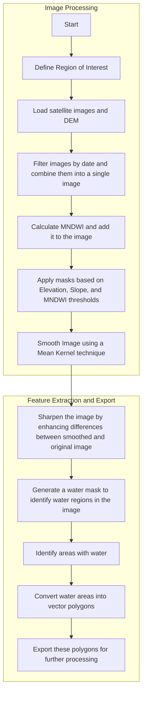

# Flowchart for GEE Lake Extraction

```mermaid
flowchart TD
    subgraph col1 ["Image Processing"]
    A[Start] --> B[Define Region of Interest]
    B --> C[Load satellite images and DEM]
    C --> D[Filter images by date and combine them into a single image]
    D --> G[Calculate MNDWI and add it to the image]
    G --> M[Apply masks based on Elevation, Slope, and MNDWI thresholds]
    M --> N[Smooth Image using a Mean Kernel technique]
    end

    subgraph col2 ["Feature Extraction and Export"]
    N --> O[Sharpen the image by enhancing differences between smoothed and original image]
    O --> P[Generate a water mask to identify water regions in the image]
    P --> R[Identify areas with water]
    R --> S[Convert water areas into vector polygons]
    S --> V[Export these polygons for further processing]
    end


```
