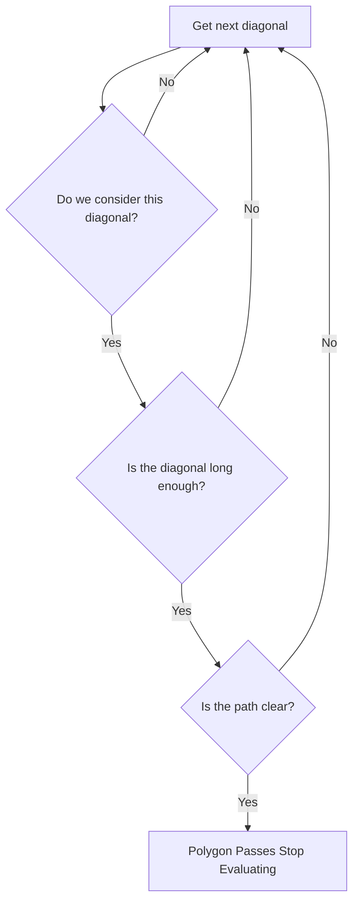

```mermaid

flowchart TD
    A[Get next diagonal] --> C{Do we consider this diagonal?}
    C -- Yes --> D{Is the diagonal long enough?}
    C -- No --> A
    D -- Yes --> E{Is the path clear?}
    D -- No --> A
    E -- Yes --> F[Polygon Passes Stop Evaluating]
    E -- No --> A
```